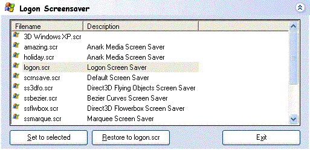



## Change XP's logon Screensaver

### Description

Shows a list of your system's screensavers and lets you replace logon.scr with what you wish (it's backed up first) thus changing your system's logon/welcome screensaver, only with a better gui than other programs that do this. You can preview the screensaver(s) by double clicking on them
 
### More Info
 
fixed bad reference to a module

             |
---                |---
**Submitted On**   |2003-03-28 23:52:32
**By**             |[Techni Rei Myoko](https://github.com/Planet-Source-Code/PSCIndex/blob/master/ByAuthor/techni-rei-myoko.md)
**Level**          |Advanced
**User Rating**    |2.4 (22 globes from 9 users)
**Compatibility**  |VB 6\.0
**Category**       |[Complete Applications](https://github.com/Planet-Source-Code/PSCIndex/blob/master/ByCategory/complete-applications__1-27.md)
**World**          |[Visual Basic](https://github.com/Planet-Source-Code/PSCIndex/blob/master/ByWorld/visual-basic.md)
**Archive File**   |[Change\_XP'1565793282003\.zip](https://github.com/Planet-Source-Code/techni-rei-myoko-change-xp-s-logon-screensaver__1-44275/archive/master.zip)

